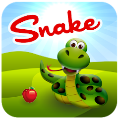
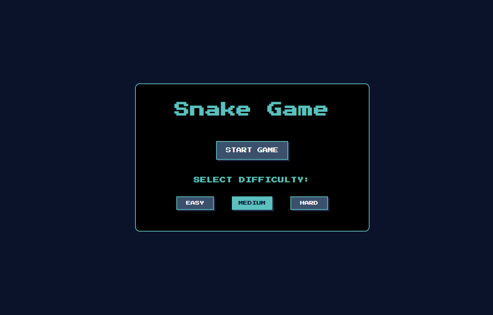
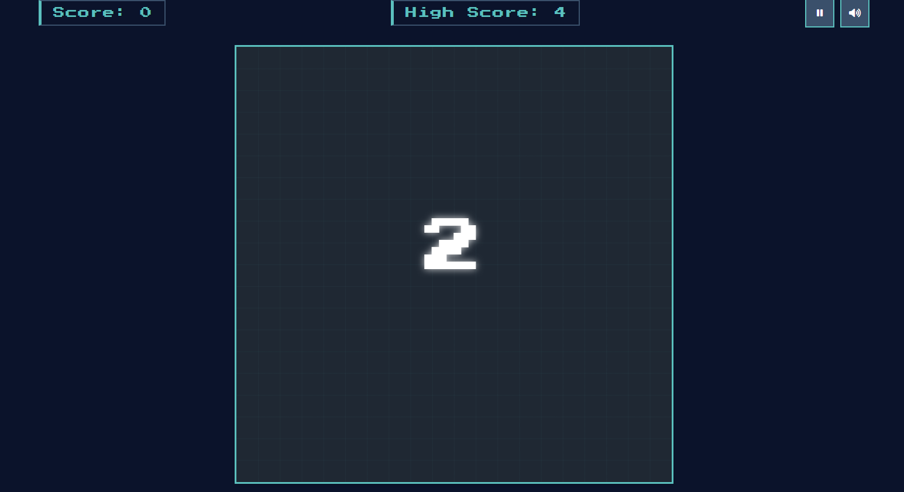
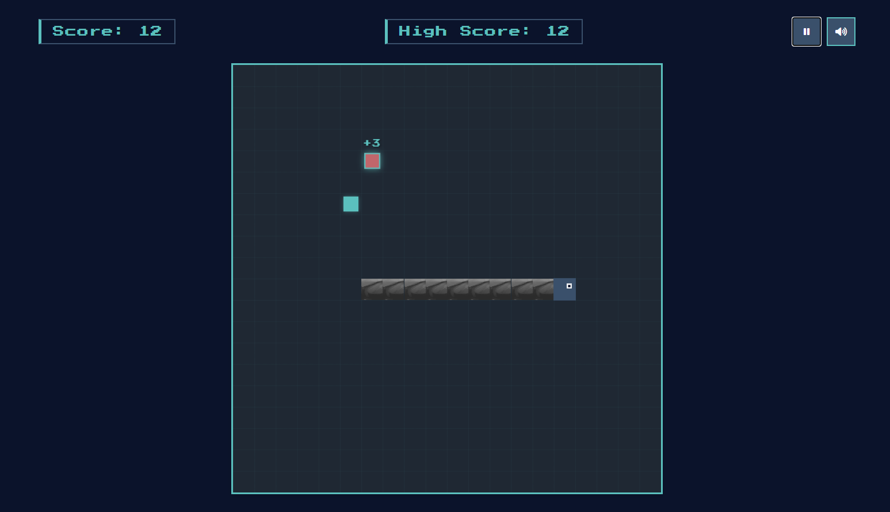

# Retro Snake Game

A modern implementation of the classic Snake game with a retro aesthetic, responsive design, and enhanced features.






## Table of Contents

- [Overview](#overview)
- [Features](#features)
- [How to Play](#how-to-play)
- [Controls](#controls)
- [Game Mechanics](#game-mechanics)
- [Technical Details](#technical-details)
- [Responsive Design](#responsive-design)
- [Installation](#installation)
- [Future Enhancements](#future-enhancements)

## Overview

This Snake Game is a modern take on the classic game that was popular on early mobile phones. It features a clean, monochrome aesthetic with a retro pixel art style. The game is fully responsive and works on both desktop and mobile devices.

## Features

- **Retro Aesthetic**: Monochrome color scheme reminiscent of old mobile games
- **Responsive Design**: Adapts to different screen sizes for both desktop and mobile
- **Multiple Difficulty Levels**: Choose between Easy, Medium, and Hard
- **Special Food Items**: Collect special food for bonus points
- **Game Controls**:
  - Pause/Resume functionality
  - Sound toggle
  - Speed adjustment
- **Mobile Touch Controls**: Dedicated on-screen buttons for mobile play
- **Score Tracking**: Current score and high score persistence
- **Visual Feedback**: Animations and visual effects enhance gameplay
- **Game States**: Start menu, gameplay, and game over screens

## How to Play

1. **Start the Game**:
   - Select a difficulty level (Easy, Medium, Hard)
   - Click "Start Game"
   - Wait for the countdown (3, 2, 1, GO!)

2. **Game Objective**:
   - Control the snake to eat food and grow longer
   - Avoid colliding with walls or the snake's own body
   - Collect special food items for bonus points
   - Achieve the highest score possible

3. **Game Over**:
   - The game ends when the snake collides with a wall or itself
   - Your final score is displayed
   - You can choose to play again or return to the main menu

## Controls

### Desktop Controls:
- **Arrow Keys**: Move the snake (Up, Down, Left, Right)
- **Space Bar**: Pause/Resume game
- **M Key**: Mute/Unmute sound

### Mobile Controls:
- **On-screen Arrow Buttons**: Tap to change direction
- **Pause Button**: Tap to pause/resume
- **Sound Button**: Tap to mute/unmute

### Additional Controls:
- **Speed Slider**: Adjust the snake's movement speed
- **Difficulty Buttons**: Select game difficulty level

## Game Mechanics

### Snake Movement
- The snake moves continuously in the current direction
- The snake cannot make a 180-degree turn (directly reverse direction)
- The snake's eyes follow the direction of movement

### Food Types
- **Regular Food**: Adds 1 point to your score
- **Special Food**: Appears occasionally after reaching 5 points
  - Worth 3-5 points
  - Disappears after 5 seconds if not eaten
  - Visually distinct from regular food

### Difficulty Levels
- **Easy**: Slower snake speed (5)
- **Medium**: Moderate snake speed (9)
- **Hard**: Fast snake speed (15)

## Technical Details

### Technologies Used
- **HTML5**: Structure and layout
- **CSS3**: Styling and animations
- **JavaScript**: Game logic and interactivity
- **LocalStorage API**: High score persistence

### Code Structure
- **HTML**: Clean semantic markup with proper game sections
- **CSS**: Modular styling with CSS variables for theming
- **JavaScript**: Object-oriented approach with clear function separation

### Key Components
- **Game Loop**: RequestAnimationFrame for smooth animation
- **Grid System**: 20x20 grid for game board
- **Collision Detection**: Wall and self-collision checks
- **Responsive Design**: Media queries for different screen sizes
- **Touch Controls**: Mobile-specific control implementation

## Responsive Design

The game is fully responsive and adapts to different screen sizes:

- **Desktop**: Full-size game board with keyboard controls
- **Tablet**: Adjusted layout with touch controls
- **Mobile**: Compact layout with optimized touch controls and UI

## Installation

1. Clone the repository:
   ```
   git clone https://github.com/yourusername/snake-game.git
   ```

2. Open the project folder:
   ```
   cd snake-game
   ```

3. Launch the game:
   - Open `index.html` in your web browser
   - Or use a local server:
     ```
     python -m http.server 8000
     ```
     Then visit `http://localhost:8000` in your browser

## Future Enhancements

Potential features for future updates:

- Different game modes (no walls, maze, obstacles)
- Power-ups (speed boost, invincibility, etc.)
- Customizable snake appearance
- Leaderboard functionality
- Level progression system
- Additional sound effects and music options

---

Enjoy the game! 🐍
